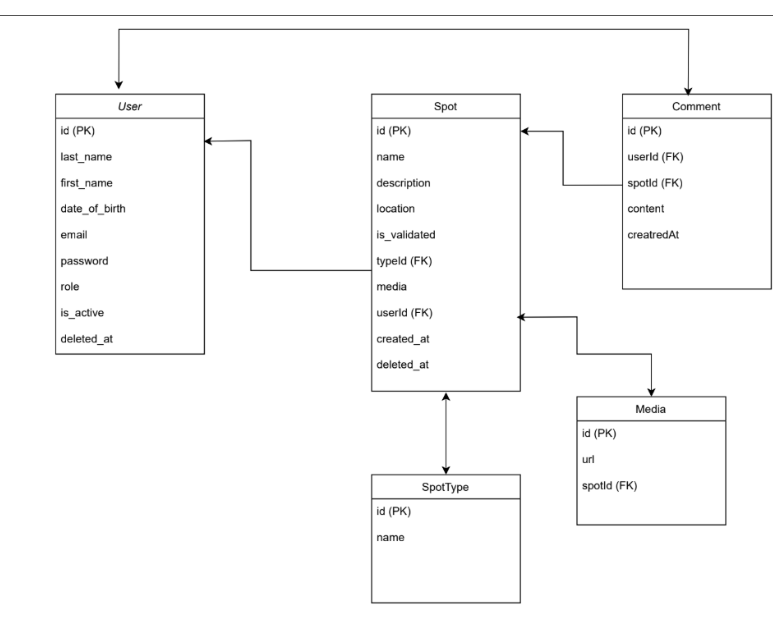
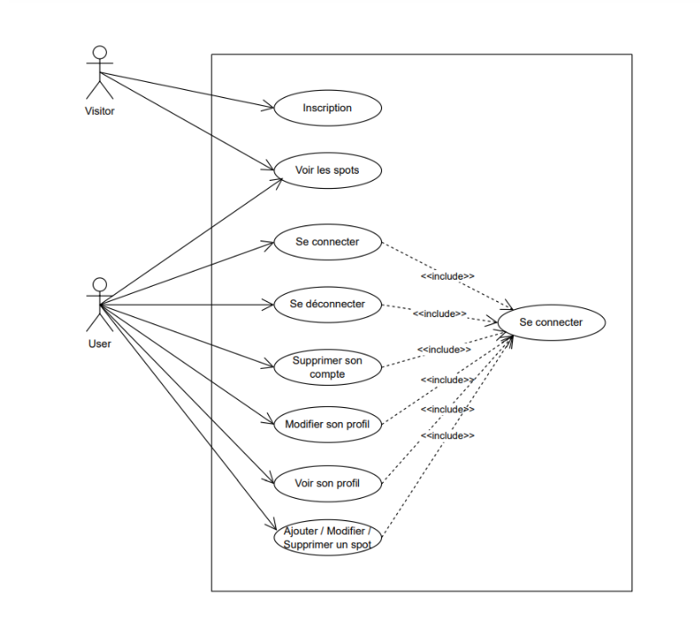
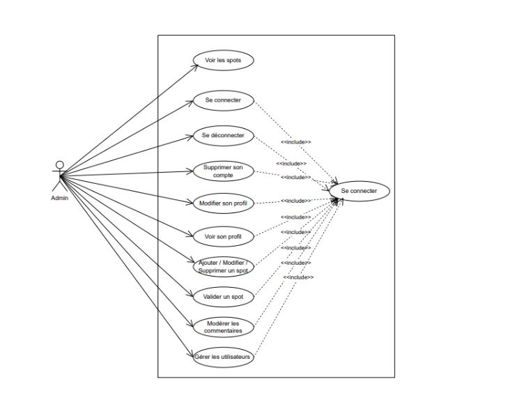
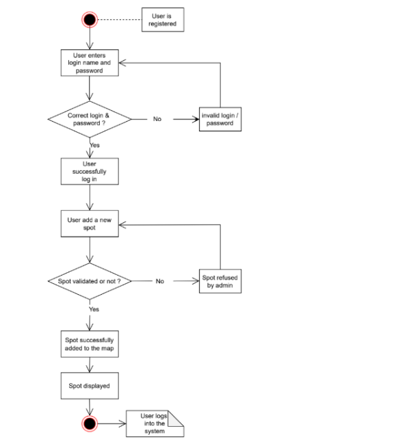
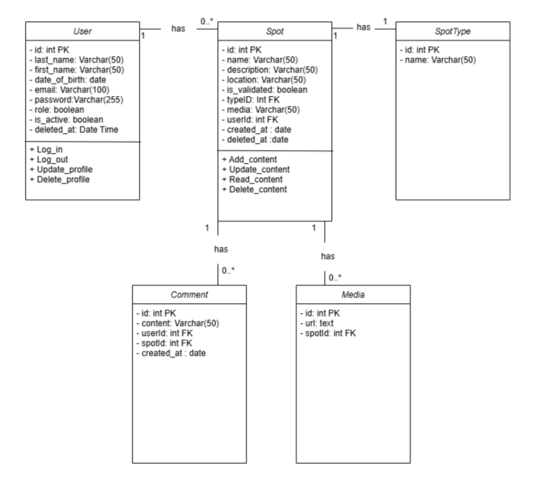

# skateMap
**A map to help riders to discover skate spots all around the world**

## application de gestion des spots de skate

### 1. Analyse des besoins

**Fonctionnalités principales :**

1. Gestion des utilisateurs :

- Inscription et connexion (avec rôles : utilisateur, administrateur).

- Profil utilisateur (nom, localisation, photo de profil, etc.).

 ### 2. Gestion des spots de skate :

- Ajout d'un spot avec description, photos, type de spot et localisation.

- Consultation des spots par ville ou quartier.

- Filtrage des spots par type (slappy, curbs, ledges, etc.).

- Validation des spots par un administrateur avant publication.

### 3. Carte interactive :

- Affichage des spots sur une carte.

- Recherche et visualisation des spots par position géographique.

### 4. Interactions sociales :

- Possibilité de laisser des avis/commentaires sur les spots.

- Notation des spots.

### 5. Administration :

- Gestion des utilisateurs et des contenus (spots, commentaires, médias).

### Types d'utilisateurs :

1. Utilisateur classique :

- Peut consulter les spots, ajouter des spots, et interagir (commentaires, notes).

2. Administrateur :

- Peut modérer les contenus et gérer les utilisateurs.

## Schéma de base de données

### Explications :

- User : Table pour les utilisateurs.

- Spot : Représente les spots de skate. Les champs incluent :

    - isValidated : indique si le spot a été validé par un administrateur.

- SpotType : Catégories de spots (slappy, curbs, etc.).

- Comment : Commentaires liés aux spots.

- Media : Photos ou vidéos associées aux spots.

### Relations clés :

- Un utilisateur peut ajouter plusieurs spots.

- Chaque spot peut avoir plusieurs images (Media).

- Un utilisateur peut commenter plusieurs spots.

- Un commentaire appartient à un seul spot.

- Un administrateur valide les spots avant leur publication.

## 3. Diagramme des cas d'utilisation (Use Case)

- [Utilisateur] --> (Consulter des spots)
- [Utilisateur] --> (Ajouter un spot)
- [Utilisateur] --> (Commenter un spot)
- [Utilisateur] --> (Noter un spot)

- [Administrateur] --> (Valider un spot)
- [Administrateur] --> (Modérer les commentaires)
- [Administrateur] --> (Gérer les utilisateurs)

## 4. Diagramme d’activité

### Ajout d’un spot :

- L'utilisateur remplit un formulaire (nom, description, photos, type, localisation).
- Les données sont envoyées au serveur.
- Le spot est marqué comme "en attente de validation".
- Un administrateur valide ou rejette le spot.
- Si validé, le spot est affiché sur la carte.
- Validation d’un spot par l’administrateur :
- L’administrateur consulte la liste des spots en attente.
- Il approuve ou rejette chaque spot.
- Les spots validés deviennent visibles pour tous les utilisateurs.

## 5. Diagramme de classe

## 6. Diagramme sémantique